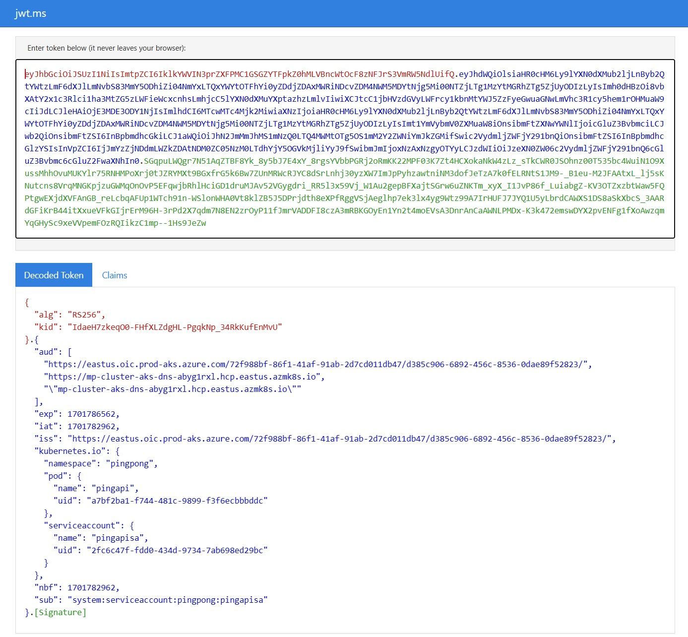

# Kubernetes Basics Workshop

## Synopsis
In this workshop, you will understand the fundamentals of containers and kubernetes by doing few simple handson exercises using Docker and Kubernetes.

## Prerequisites
Following software must be installed and ready prior to the workshop:
### 1. Development system (Windows or Linux)
- On Windows - [Windows Subsystem for Linux](https://learn.microsoft.com/en-us/windows/wsl/install), [Docker Desktop](https://docs.docker.com/desktop/install/windows-install/), [VS Code](https://code.visualstudio.com/Download), [Kubernetes-CLI (kubectl)](https://kubernetes.io/docs/tasks/tools/install-kubectl-windows/), [Azure CLI](https://learn.microsoft.com/en-us/cli/azure/install-azure-cli-windows?tabs=azure-cli)
- On Linux client with GUI – [Docker](https://docs.docker.com/desktop/install/linux-install/), [VS Code](https://code.visualstudio.com/Download), [kubectl](https://kubernetes.io/docs/tasks/tools/install-kubectl-linux/), [Azure CLI](https://learn.microsoft.com/en-us/cli/azure/install-azure-cli-linux?pivots=apt)
- Optional – [Windows Terminal](https://learn.microsoft.com/en-us/windows/terminal/install) on Windows
- Optional – VS Code extensions for [Docker](https://code.visualstudio.com/docs/containers/overview), [Kubernetes](https://code.visualstudio.com/docs/azure/kubernetes)
- Optional – [K9s](https://k9scli.io/topics/install/) (use [choco](https://chocolatey.org/install) toolchain to install on Windows)
### 2. Kubernetes cluster 
You require a K8s cluster - use any of the following options per your convenience and resource availability:

- Option1 (Recommended): On Azure – Install an [AKS](https://learn.microsoft.com/en-us/azure/aks/learn/quick-kubernetes-deploy-portal?tabs=azure-cli) cluster with minimal configuration (e.g. single node D4s) – do NOT deploy the application mentioned in the documentation

- Option2: On Windows with WSL2 – [Kubernetes engine provided by Docker Desktop](https://docs.docker.com/desktop/kubernetes/)  or [KIND](https://kind.sigs.k8s.io/docs/user/quick-start/)
		
- Option3: On Linux – [KIND](https://kind.sigs.k8s.io/docs/user/quick-start/)  or [K3s](https://docs.k3s.io/quick-start)

### 3. Container Registry
You will need a Container registry for the container images.
- On Azure – Provision an Azure Container Registry (ACR) resource – [link](https://learn.microsoft.com/en-us/azure/container-registry/container-registry-get-started-portal?tabs=azure-cli)
		
OR
- On Docker hub – Create an [account](https://hub.docker.com/) if you do not already have one
## Container Fundamentals

Reference: [How containers work](https://learn.microsoft.com/en-us/virtualization/windowscontainers/about/#how-containers-work)

#### Sample Docker Solution

### 4. Activity: Containerize a simple web application

In this activity you will modify the Dockerfile and build container images using Docker for the Ping and Pong Services. You will use the same Dockerfile for both the services and add the specifics such as executable and port number through build arguments.

    Note: Source files path - src/docker

#### 4a. Update the Dockerfile

- Use a jdk base image
        
        FROM openjdk:8-jdk-alpine
- copy the executable to be launched within the container 
        
        COPY ${JAR_FILE} app.jar 

- expose a port

        EXPOSE ${PORT}

Reference:  [Dockerfile](https://docs.docker.com/engine/reference/builder/#from), [FROM](https://docs.docker.com/engine/reference/builder/#from), [COPY](https://docs.docker.com/engine/reference/builder/#copy), [ARG](https://docs.docker.com/engine/reference/builder/#arg), [EXPOSE](https://docs.docker.com/engine/reference/builder/#expose), [ENTRYPOINT](https://docs.docker.com/engine/reference/builder/#entrypoint)

#### 4b. Build the Container images

     Note: path src/docker

- Ping Service Image

    Use docker command to build the ping service image by passing the ping.jar as the executable and 8090 as port.

        docker build -t ping:local -f ./dockerfile --build-arg JAR_FILE="./apps/ping.jar" --build-arg PORT="8090" . 

- Pong Service Image

    Build the pong service image by passing the pong.jar as the executable and 9090 as port.

        docker build -t pong:local -f ./dockerfile --build-arg JAR_FILE="./apps/pong.jar" --build-arg PORT="9090" . 

- Check if the images are listed
  - Linux
        
        docker images | grep "local"

  - Windows
       
        docker images | findstr "local"

Reference: [Docker build](https://docs.docker.com/engine/reference/commandline/build/), [image tag](https://docs.docker.com/engine/reference/commandline/build/#tag), [--build-arg](https://docs.docker.com/engine/reference/commandline/build/#build-arg), [build context](https://docs.docker.com/build/building/context/)

#### 4c: Run the Ping and Pong Containers

- Run the ping app container

        docker run -it --rm --name ping -p 8090:8090 ping:local

- Access the [pinger web api](http://localhost:8090/ping/1)

        localhost:8090/ping/1

- Debug the issue inside the ping container

        docker exec -it ping env

- Create a docker network

        docker network create test

- Run the dependency container for the cachedb  (note the --name redis and --net=test)

        docker run -itd --net=test --name redis -p6379:6379 redis

- Run ping in background but interactive mode in the same network and pass the cache container name in the env

         docker run -itd --env CACHE_HOST=redis -p8090:8090 --name ping --net=test ping:local

- View the logs of ping container
                
        docker logs -f  ping

- Access the [pinger web api](http://localhost:8090/ping/1)

        localhost:8090/ping/1

- Invoke the ping api once more and set a new key

        localhost:8090/ping/2

#### 4d: Try similar steps for the pong container

Once the pong container is ready, the app can be accessed at 

- key 1

        localhost:9090/pong/1

- key 2

        localhost:9090/pong/2

#### 4e: Clean up

- Delete the containers

        docker rm -f ping pong redis

- Delete the docker network

        docker network rm test

### 5. Container Registry

#### 5a. Activity: Login to Container Registry

- Docker Hub 

        docker login -u <your dockerhub username>

**OR**

- Azure Container Registry (ACR)

    - If you have not completed the prerequisites 
    
        - [Create New ACR](https://learn.microsoft.com/en-us/azure/aks/cluster-container-registry-integration?tabs=azure-cli#create-a-new-acr)
        
        - [Create New AKS with access to the ACR](https://learn.microsoft.com/en-us/azure/aks/cluster-container-registry-integration?tabs=azure-cli#create-a-new-aks-cluster-and-integrate-with-an-existing-acr)

    - If you created AKS without a new ACR OR want o use an existing ACR

       - [Attach an AKS resoure to existing ACR](https://learn.microsoft.com/en-us/azure/aks/cluster-container-registry-integration?tabs=azure-cli#attach-an-acr-to-an-existing-aks-cluster)

- Login to ACR using Az CLI

       az acr login -n <name of acr>

#### 5b. Tag and Push Images to Container Registry

- Image Name    
    -   Dockerhub 
        
             docker.io/<your dockerhub username>/ping:v1
             docker.io/<your dockerhub username>/pong:v1
   -   Azure CR 
        
            <acrname>.azurecr.io/ping:v1
            <acrname>.azurecr.io/pong:v1
-  Activity: Tag and Push 
   - Tag

         docker tag ping:local <imagename>
         docker tag pong:local <imagename>
   - Push
         
         docker push <imagename>

#### 5c. Test Run using CR image
-    Check if the container starts (error messages for n/a of redis is OK )
        
           docker run --rm pingtest <pingservice CR imagename>

## Kubernetes Fundamentals

### Sample Kubernetes Solution 

### 6. Activity: Set Kubernetes Cluster Context

#### 6a. If you are using Kubernetes engine provided by Docker-Desktop on Windows WSL2, then set the context to the local cluster "docker-desktop"

        kubectl config use-context docker-desktop

#### 6b. If you are using Azure Kubernetes Service (AKS), use Az CLI to get credentials and set the context to the AKS cluster

        az aks get-credentials -n <aks-cluster-name> -g <rg-name>

#### 6c. Verify that the context is set to the correct cluster

        kubectl config get-contexts

### 7. Activity: Create a kubernetes namespace

Reference: [namespaces](https://kubernetes.io/docs/concepts/overview/working-with-objects/namespaces/)

        Source Path: src/k8s/1.namespace/
        File: ns.yaml

Use kubernetes CLI (kubectl) to
- Create a new namespace "pingpong"
        
        kubectl create -f ns.yaml
- Verify
        
        kubectl get ns

### 8. Activity: Deploy the Ping App

Reference: [Kubernetes Deployment](https://kubernetes.io/docs/concepts/workloads/controllers/deployment/), [ReplicaSet](https://kubernetes.io/docs/concepts/workloads/controllers/replicaset/)

You will deploy the ping app using a "pod" manifest

        Source path: src/k8s/2.ping/
        File: deployment.yaml

- Modify the deployment.yaml to set the docker image name for the container and the namespace

- Schedule the ping deployment. 

        kubectl create -f pod.yaml -n pingpong

- Verify if the deployment and pod resources are created

    - pingapi Deployment resource

          kubectl get deployments -n pingpong

    - pingapi Pod resource

          kubectl get pods -n pingpong

- See the container logs

        kubectl -n pingpong logs pingapi
   
- Describe the pod

        kubectl -n pingpong describe pod pingapi

- Try accessing the ping api as before using pod ip

        http://{pod ip}:8090/ping/1

### 9. Image Pull Credentials
If your container images are in a private regisry such as ACR, Kubernetes will need the permission to pull the images during pod scheduling. There are multiple scenario based options:

#### Option1: AKS Attach - Attach AKS Cluster to ACR
- [Existing AKS Cluster](https://learn.microsoft.com/en-us/azure/aks/cluster-container-registry-integration?toc=%2Fazure%2Fcontainer-registry%2Ftoc.json&bc=%2Fazure%2Fcontainer-registry%2Fbreadcrumb%2Ftoc.json&tabs=azure-cli#configure-acr-integration-for-an-existing-aks-cluster)

- [New AKS Cluster](https://learn.microsoft.com/en-us/azure/aks/cluster-container-registry-integration?toc=%2Fazure%2Fcontainer-registry%2Ftoc.json&bc=%2Fazure%2Fcontainer-registry%2Fbreadcrumb%2Ftoc.json&tabs=azure-cli#tabpanel_2_azure-cli)

#### Option2: CR Credentials
Store the CR credentials in a K8s Secret and use the secret as ImagePullSecret in the manifest

- Create K8s [Secret](https://kubernetes.io/docs/tasks/configure-pod-container/pull-image-private-registry/#create-a-secret-by-providing-credentials-on-the-command-line)

- Update the pod.yaml / deployment.yaml to use the secret in the spec

        imagePullSecrets:
        - name: {K8s secret name that has the CR creds}

#### Option3: Azure MSI based Workload Identity
We will not try this option as part of this lab. You can do this as part of your post lab learning
- [AKS MSI](https://learn.microsoft.com/en-us/azure/aks/use-managed-identity)

- [AcrPull Role](https://learn.microsoft.com/en-us/azure/container-registry/container-registry-roles?tabs=azure-cli#pull-image) - Assign to MSI

### 10.  Activity: Deploy a K8s service for the Ping Api

Reference: [Kubernetes Service](https://kubernetes.io/docs/concepts/services-networking/service/)

        Source path: src/k8s/2.ping
        File: service.yaml

- 10a. Modify the service.yaml 

    - AKS

        - Set the service type to "LoadBalancer"

    - Local Kubernetes w/o LB (DockerDesktop or KIND)

        - No changes needed 
        - Service type will be "ClusterIP"

- 10b. Deploy the K8s service for ping pod

        kubectl -n pingpong create -f service.yaml

- 10c. Verify Service
        
        kubectl -n pingpong get services

    - Note: Wait for the external IP (in case of AKS/ MetaLB or or such platform LB) to be available

### 11. Activity: Access Ping API using the K8s service

- 11a. Access the ping api using the K8s service's IP

    - AKS
        
          http://<external-ip>:8090/ping/1

    - Local Kubernetes 

        1. Port forward the ClusterIP service to local network

                kubectl -n pingpong port-forward service/pingservice 8090:8090

        2. Access locally

                http://localhost:8090/ping/1

- 11b. Let's get inside the ping container and access the api endpoint locally

    - Grab the main container shell
        
           kubectl exec -ti pingapi -n pingpong -- /bin/sh

    - cUrl OR wget

    -       curl http://localhost:8090/ping/1

    -      
           wget http://localhost:8090/ping/1

You should see the endpoint is accessible (though the it returns 500 status code - we will RCA and fix this 500 response in subseqent steps)

- 11c. Describe the service to check if it is bound to the container endpoint

        kubectl -n pingpong describe service pingservice

    - If the EndPoints value is None, no container is bound to the service and no routing will happen for the service IP  

- 11d Update the pingapi pod.yaml metadata to set the tier label  to "frontend"

        kubectl -n pingpong apply -f pod.yaml

        
- 11e. Describe the service again to verify the endpoints is now set to the pod IP

- 11f. Access the ping service

    - Dont forget to port-forward in the case of local kubernetes
    - Should see response (although it is 500)

- 11g. Scale the deployment 

    - Scale to 3 pods

          kubectl -n pingpong scale deployment pingapi --replicas=3

    - Verify

          kubectl -n pingpong get pods

    - Replicaset
          
          kubectl -n pingpong get rs

### 12. Activity: Deploy the Cache DB

#### Lets fix the 500 status code - you guessed right, we need the redis service.

Reference: [Kubernetes Pods](https://kubernetes.io/docs/concepts/workloads/pods/)

        Source Path: src/k8s/3.cache
        Files: pod.yaml, service.yaml

- 12a. Submit a redis pod scheduling and an internal service to the cluster

    - Create pod and service
        
            kubectl -n pingpong create -f ./
    - Verify Pod
    
            kubectl -n pingpong get pods
    - Verify service     
            
            kubectl -n pingpong get svc redis

        Note: No external IP for redis service, refer our [architecture diagram](../docs/k8s-samplesolution.png)

- 12c. Check the ping service
    - AKS
 
          http://<external-ip>:8090/ping/1

        - Note: Due to security policies in few Azure tenants, AKS resources will need more configuration to access the service publicly. If you are unable to access the external-ip then do port-forwarding as described for local Kubernetes 

    - Local Kubernetes (DockerDesktop)

        -      kubectl -n pingpong port-forward service/pingservice 8090:8090

       - [Link](http://localhost:8090/ping/1) -     
         http://localhost:8090/ping/1
         
         http://localhost:8090/ping/2

     - Ping service should work now

### 13. Deploy the Pong Service

        Source Path: src/k8s/4.pong

- Submit the deployment and service yamls
- Check if the pong service is accessible

        http://{pong-service-public-ip}:9090/pong/{key}

   - Note: Due to security policies in few Azure tenants, AKS resources will need more configuration to access the service publicly. If you are unable to access the external-ip then do port-forwarding as described for local Kubernetes 

### 14. Service Accounts and Volumes

Reference: Kubernetes [Service Accounts](https://kubernetes.io/docs/concepts/security/service-accounts/#what-are-service-accounts), [Volumes](https://kubernetes.io/docs/concepts/storage/volumes/), 

Now, you will add a ServiceAccount to the PingApi Pod and project the token as a volume

#### 14a. Create a Service Account

        Source Path: src/k8s/2.ping
        Files: serviceAccount.yaml, deployment.yaml

- Create a new manifest serviceAccount.yaml with the following content

        # Ping API ServiceAccount
        
        apiVersion: v1
        kind: ServiceAccount
        metadata:
          name: pingapisa
          namespace: pingpong
                

- Update the deployment.yaml of ping api to project the service account

        .....
        serviceAccountName: pingapisa

        .....
        volumeMounts:
          - name: ping-psat
            mountPath: /var/run/secrets

        .....

        volumes:
        - name: ping-psat
          projected:
            sources:
            - serviceAccountToken:
                path: ping
                expirationSeconds: 3600

- Submit the manifests

    - Service
        
            kubectl -n pingpong create -f ./serviceAccount.yaml
        
        
     - Deployment
        
            kubectl -n pingpong apply -f ./deployment.yaml

- View the PSAT

        kubectl -n pingpong exec -it ping -- cat /var/run/secrets/pingapi

- Copy the token and view its content - [jwt.ms](https://jwt.ms)

### 15. Optional Activity: Cross Namespace Service Access

Deploy redis to a different namespace and make the ping service work with that cache

- Delete redis deployment and service in pingpong ns
- Create redis deployment in another ns, say "cache"

        Hint: Access pattern: {servicename}.{ns}.svc:port

### 16. Optional Activity: Create an Ingress for the ping K8s service

Note: Service type will be ClusterIP

Reference: [Ingress](https://kubernetes.io/docs/concepts/services-networking/ingress/), [Ingress Controller](https://kubernetes.io/docs/concepts/services-networking/ingress-controllers/)

#### Options:
- [NGINX Ingress](https://kubernetes.github.io/ingress-nginx/user-guide/basic-usage/)
- [Azure Application Gateway ](https://learn.microsoft.com/en-us/azure/application-gateway/ingress-controller-overview)
